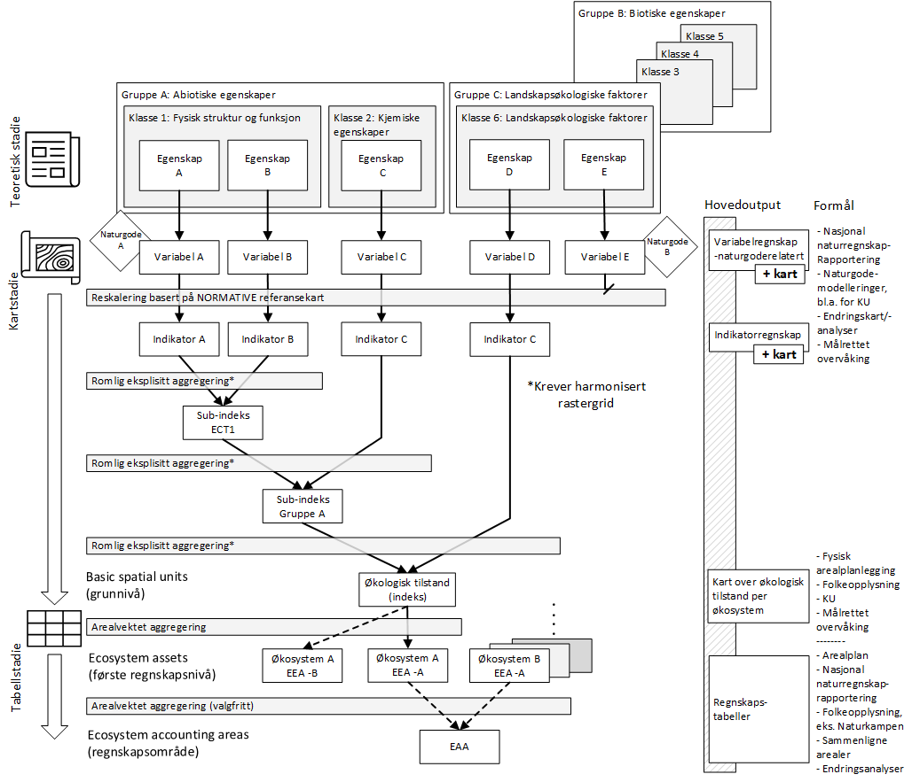
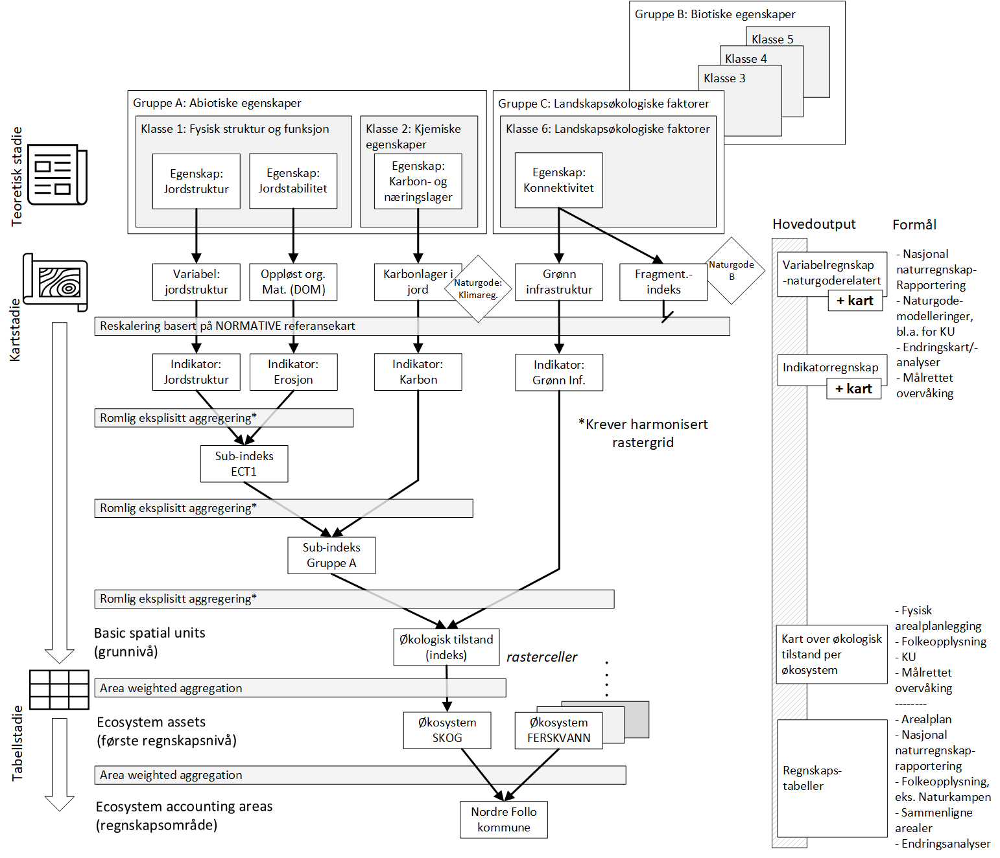

# Arbeidsflyt

Her beskrives den generelle, eller mest typiske, arbeidsflyten.

(\#fig:workflow)Dette er den typiske arbeidsflyten for generering av økologisk tilstandsregnskap for norske kommuner

Figur \@ref(fig:workflow) viser den typiske arbeidsflyten.
[Klikk her](https://github.com/NINAnor/tilstandsregnskap_NordreFollo2022/tree/main/figures/ECA_Workflow_generisk_norsk.pdf) for en høyoppløselig pdf-versjon.

Denne arbeidsflyten er betraktelig endret fra den som ble brukt i fremstillingen av de nasjonale tilstandsrapportene for skog [@Framstad2021] og fjell [@Framstad2022] både med tanke på hvordan vektingene ble utført og på hvor stor vekt det var på kart- versus tabellstadiet. 

(\#fig:workflow2)Dette er en eksemplifisert versjon av den typiske arbeidsflyten for generering av økologisk tilstandsregnskap for norske kommuner

[Klikk her](https://github.com/NINAnor/tilstandsregnskap_NordreFollo2022/tree/main/figures/ECA_Workflow_eksempler_norsk.pdf) for en høyoppløselig pdf-versjon.

## Minimalt indikatorsett
For å teste den typiske arbeidsflyten i Figur \@ref(fig:workflow) trengs en minimalt indikatorsett.
Dette indikatorsettet må inkludere variabel A-D (mulghens også E), samt minst en indikator fra ett annet økosystem.
I Figur \@ref(fig:workflow2) er det satt navn på noen av disse variablene og indikatoren, men dette er bare tenkt som et eksempel.
Det minimale indikatorsettet skal gjøre det mulig å utvikle og teste alle de forskjellige aggregeringsstegene i arbeidsflyeten.
Tanker er å delvis automatisere denne arbeidsflyten, eksempelvis ved bruk av *targets* ^[https://books.ropensci.org/targets/].
