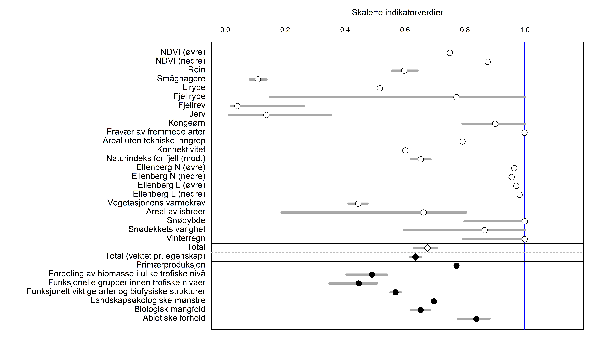
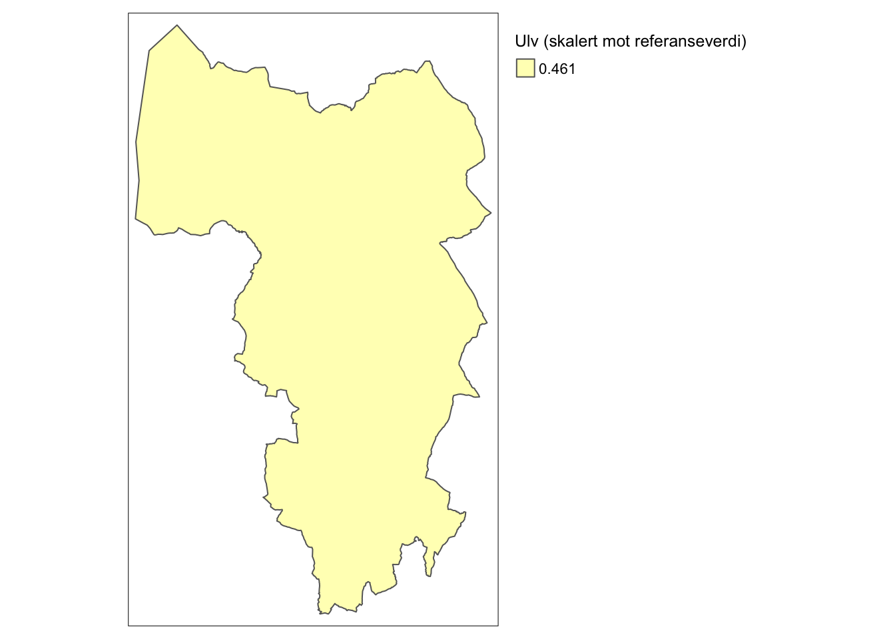
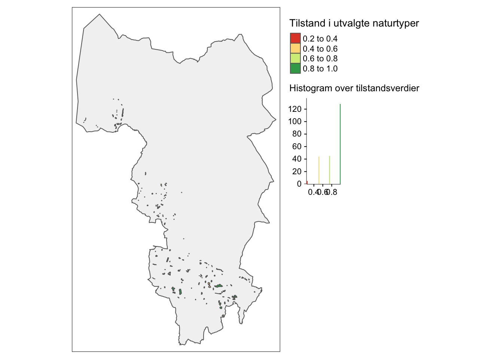

# Indikatorer

Tilstandsindikatorer er re-skalerte variabler (jf. Figur \@ref(fig:workflow)).
De bør oppfylle så mange av de følgende punktene som mulig (liste hentet fra [@Nybø2017]):

1. gi et representativt bilde av miljøets tilstand, miljøpåvirkninger eller samfunnets respons
1. være enkel, lett å tolke og i stand til å vise trender over tid
1. respondere på endringer i miljøet og relaterte menneskelige aktiviteter
1. gi grunnlag for internasjonale sammenligninger
1. være relevant for det arealet som vurderes
1. ha en terskelverdi eller referanseverdi som den kan sammenlignes mot, slik at brukere kan vurdere betydningen av indikatorens verdi 
1. være teoretisk godt fundert i tekniske og vitenskapelige termer
1. være basert på internasjonale standarder og internasjonal konsensus om gyldighet
1. være egnet til å kobles mot økonomiske modeller, prognoser og informasjonssystemer
1. være lett tilgjengelig eller kunne gjøres tilgjengelig på en kostnadseffektiv måte
1. være godt dokumentert og av kjent kvalitet
1. oppdateres jevnlig i samsvar med utarbeidede prosedyrer

Se også [@Czúcz2021] for flere kriterier til indikatorer.

I tillegg sier FN-standarden for tilstandsregnskap [@UN2021] at hver ECT-klasse dekkes med minst en indikator per økosystem, og det bør være ca. 6-10 indikatore totalt per økosystem.

(\#fig:hovedfigurfjell)Hovedfiguren fra rapporten om økologisk tilstand i norske fjelløkosystemer.

Figur \@ref(fig:hovedfigurfjell) er hovedfiguren fra rapporten om økologisk tilstand i fjell i Norge, hvor det er brukt hele 19 indikatorer.
Merk at de fleste (om ikke alle) av disse indikatorene ikke vil vise noe fornuftig variasjon innad i en kommune. 
Det kommer blant annet av at det er landskapsøkologiske prosesser som styrer de, eksempelvis tetthetenen av hjortevilt og rovdyr.
Klimaderiverte indikatorer, slik som snødybde, vil trolig variere lite. 
For andre indikatorer finnes det informasjon på en fin skala (eksempelvis NDVI som kommer som 250m x 250m raster), men at usikkerheten er større enn variasjonen mellom naboceller, slik at man bør unngå å overtolke den finskala variasjonen.

Tabellen over er hentet fra [@Czúcz2021]

Her kommer korte beskrivelser for hver tilstandsindikator, fordelt på økosystemtype, med lenke til mer utfyllende dokumentasjon

## Skog
Økosystem skog er dekket med **XX** antall indikatorer fordelt på **YY** antall ECT-klasser.

### Rovdyr {-#rovdyr}

ECT-klasse | Referansestadie | Status
---------- | ------------- | --------------
B1 (Compositional state) |  For-historisk (*Undisturbed or minimally-disturbed condition*) | **Foreløpig inkludert**

Denne indikatoren skal baseres på total metabolsk biomasse av større rovdyr, men foreløpig er kun ulv tatt med i utregningene.

Denne indikatoren har helt lik skalert verdi for hele kommunen og det er en såkalt **uniform indikator**.
Slik ser oppløsning av dataene ut for hele norge (hentet fra Naturindeks.no)

(\#fig:ulvNI)Kart som viser oppløsningen av den skalerte ulveindikatoren fra NAturindeks.

[Klikk her](https://github.com/NINAnor/naturregnskap/tree/main/R/conditionIndicators/pdfOutput/rovdyr_NordreFollo.pdf) for mer informasjon om utregegningen av rovdyrindikatoren.

### Tilstand i naturtyper {-#naturtyper}

ECT-klasse | Referansestadie | Status
---------- | ------------- | --------------
Flere |  Variert | **Foreløpig ekskludert**

Dette er et typisk **frimerkekart**.
Å inkludere denne indikatoren vil derfor ikke få stor invirkning på de romlig aggregerte tilstandsverdien (jf. Figur \@ref(fig:workflow)).
En annen utfordring med denne indikatoren er at tilstandsvariabelen egentlig er en kombinasjon av faktiske tilstandsvariabler og registrert menneskelige påvirkninger.

## Ferskvann

kommer snart...

