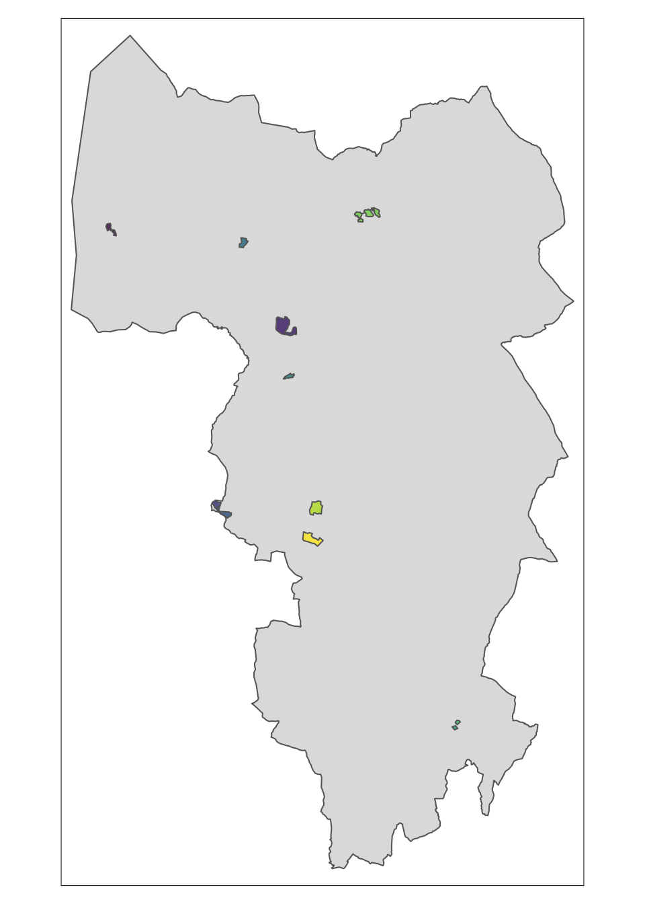
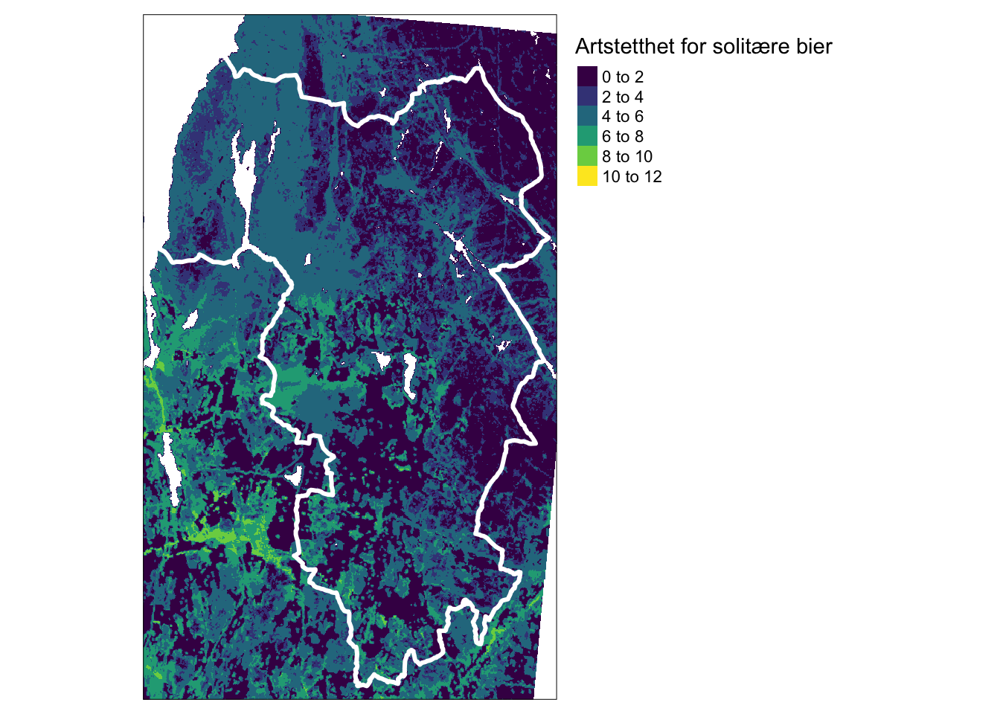
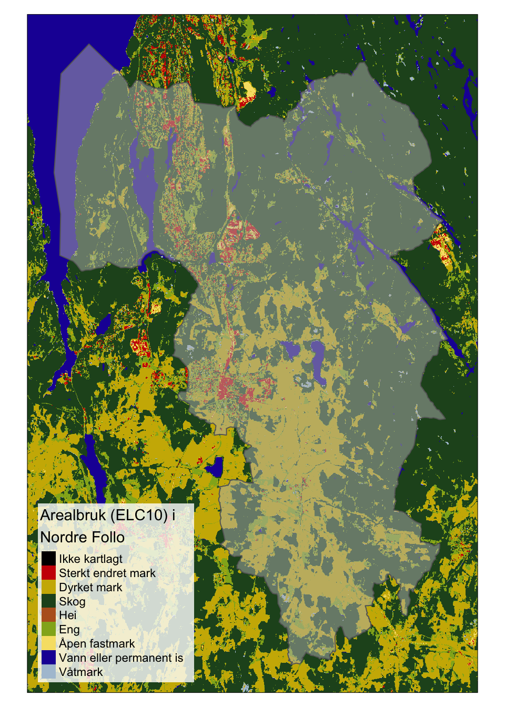
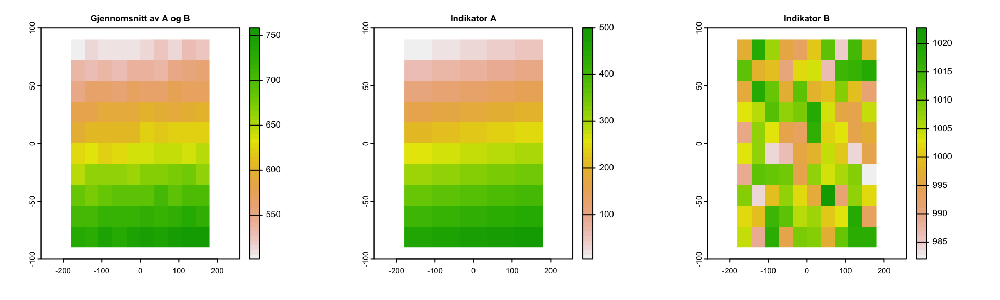
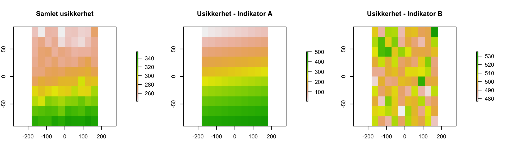

# Eksempler

På denne siden vises det frem en del eksempler og diskusjonspunkter.

## Tolv boligområder {-}

Hvilken oppløsning kan vi forvente fra økologisk tilstand?
Kan økologisk tilstand brukes som kunnskapsgrunnlag i arealbrukssaker? 
Kartet under viser 12 realle prosjektområder/boligområder i Nordre Follo kommune.
Kan økologisk tilstand brukes til å informere om hvordan disse områdene bør disponeres?

[//]: # (importer boligområdene. Shapefil levert av David Barton)

[//]: # (Importerer omrisset til Nordre Follo)

[//]: # (Skru på interaktivt kartmodus)

Områdene er spredt rundt i hele kommunen og har et areal fra 0.01 til 0.2 km2.

De aller fleste indikatorene for økologisk tilstand vil ikke ha en oppløsning (se [*rovdyrindikatoren*](https://ninanor.github.io/tilstandsregnskap_NordreFollo2022/indikatorer.html#rovdyr)) eller dekkningsgrad (se [*Tilstand i naturtyper*-indikatoren](https://ninanor.github.io/tilstandsregnskap_NordreFollo2022/indikatorer.html#naturtyper)) som gjør det mulig å skille disse områdene.
Derfor vil ikke en tematisk aggrering av økologisk tilstand kunne gi denne type infomarjon heller.
Derimot vil det i arbeidet med et naturregnskap kunne utarbeides og presenteres flere interessente kartlag som kan informere arealforvaltningen, slik som variabelen [*Artstetthet av solitære bier*](https://ninanor.github.io/tilstandsregnskap_NordreFollo2022/eksempler.html#pollinatorrikhet), samt flere kart fra naturgoderegnskapet.
Disse kartene kan ikke sies å represnetere økologisk tilstand som sådann, men kan allikevel inngå i kunnskapsgrunnlaget på lik linje som artsdata og forkomster av naturtyper som presenteres i [portalen for økologisk grunnkart](https://okologiskegrunnkart.artsdatabanken.no/?favorites=false).

I tillegg utreder NINA mulighetene for å gjennomføre [feltbasert kartlegging](#registrer-økologisk-tilstand-i-felt) av naturtyper og tilstand etter en protokoll utviklet i Storbrittania.
Denne kartleggingen kan kunne inngå som en del av et tilstandsregnskap og vil potensielt kunne gi arealforvaltningen kunnskap om økologisk tilstand i utvalgte prosjektomrder.

## Indikatorer og variabler {-}
Her følger noen eksempler på ulike variabler og indikatorer og hvordan de kan inngå i [arbeidsflyten](arbeidsflyt.html).

### Pollinatorrikhet {-}

Dette datasettet tetthet av solitaerebier representerer en arealdekkende modellering av artstetthet av solitære bier på en 20 x 20 meters oppløsning [@Sydenham2022; @Sydenham2022b].

[//]: # (Skru på interaktivt kartmodus)

(\#fig:bier)Modellert artsrikhet av solitære bier (se tekst for referanse).

Solitære bier er viktige pollinatorer.
Slik sett kan dette være en fin tilstandsvariabel siden det relevant for pollinering, en sentral naturgode.
Det er ikke ennå klart hvordan denne variabelen kan skaleres til å bli en indikator (jf. Figur \@ref(fig:workflow) ) ,
men det er heller ikke umulig at dette kan utvikles på sikt.
Kartet er heldekkende, men denne variabelen er trolig mest relevant for åpent lavland, spesielt semi-naturlig mark, siden det er her man kan forvente å finne solitære bier.

## Noen utfordringer ved vegg-til-vegg regnskap {-}

I Nordre Follo skal det gjøres et vegg-til-vegg regnskap, i motsettning til i de nasjonale vurderingene hvor man har gjort ett og ett økosystem om gangen. Det vil si at man i Nordre Follo må ha indikatorer for alle de økosystemene eller arealtypene som finnes der. Som vi ser under så er det ganske mange. 

(\#fig:unnamed-chunk-9)Kart over Arealtyper i Nordre Follo kommune.

Spesielt vannskelig blir det å finne indikatorer for våtmark, sterkt endret mark (inkl. bebygd areal) og semi-naturlig mark.  Realistisk sett vil det ikke bli mulig å få samme indikatordekning på alle arealer, som vi hadde i de nasjonale vurderingene. Samtidig vil oppløsning på den holistiske tilstandsvurderingen, basert på indikatorer som ligner de vi har brukt i de nasjonel tilstandsvurderingen, ikke gi grunnlag for sikkert å skille lokale områder. 

## Tilnærminger til aggregering {-}
Metoden legger opp til å aggreggere verdier gjennom flere indikatator-rastere. 
I denne aggregeringen er det viktig å få med seg usikkerhetene i hver indikator og ikke bare ta gjennomsnittet av gjennomsnittene.
Her er et gernalisert eksempel som viser hvordan dette kan gjøres. 

Hver av indikatorene har sin egen usikkerhet representert i tilsvarene rasterlag. 
Vi regner ut total usikkerhet slik: 

Equation \@ref(eq:ncrep)

\begin{equation}
    \delta z = \frac{\sqrt{ \delta x^2 + \delta y^2 }}{n}
    (\#eq:ncrep)
\end{equation}

hvor delta z er den samlede  usikkerheten for n antall indikatorer.

Dette gir oss en samlet indeksverdi på 626.6 pluss minus 287.8.

## Registrer økologisk tilstand i felt {-}

Dersom en skal beregne økologsik tilstand etter fagsystemet vil dette av flere grunner ha [begrenset oppløsning](#tolv-boligområder), og derfor noe begreset bruksverdi i konkrete arealbruksvurderinger innad i kommunene. 
Det som kan være en løsning for å dekke dette behovet er lokal datainnsamling av tilpassede tilstandsindikatorer knyttet til naturtyper eller arealtyper. Det beste eksempelt på dette som vi vet om er [the biodiversity metric](http://nepubprod.appspot.com/publication/6049804846366720). 

## The Biodiversity Metric {-}
Dette er en feltprotokoll og regneverktøy utviklet av eller med Natural England og skal brukes for å overvåke i hvilken grad nye byggeprosjekter i England oppfyller kravene i Biodiversity Net Gain strategien. Det gjøres en arealdekkende naturtypekrtlegging (i motsettnign til Naturtyper etter Miljødirektoratets instruks, som er det som benyttes i norske konsekvensutredninger blant annet) av interesseområdet og så bestemmes den økolgiske tilstanded ved hjelp av en kriterieliste. Kriterielisten er en liste med ja-nei spørsmål, noe som gjør feltinnsamlingen mye raskere enn om det skulle taes kvantitative mål. Listen av kriterier for god økologisk tilstand er unik for hver naturtype og kan være circa 7 punkter lang. Under kan du se kriteriene for noen kystnære, terrestriske økosystemer.

