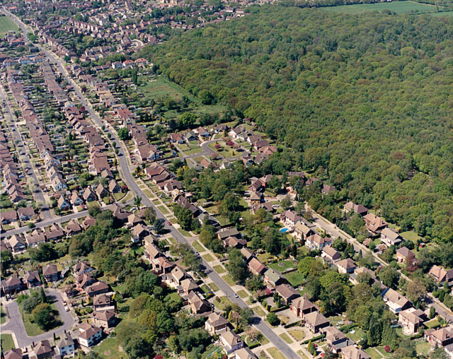

# Naturregnskap hos NINA
Trond test
På denne nettressursen samles informasjon, dokumentajon og resultater relatert til utarbeidelsen av et naturregnskap i Nordre Follo kommune i 2022.

 

[Klikk her](https://ninanor.github.io/naturregnskap/) for å gå til en lesevennlig fremstilling.

Bilde: Økologisk tilstand sier noe om hvilken påvirkning menneskelig aktivitet har på økosystemens integritet. Edward Clack / Aerial view of Scrub Lane and Belfairs Nature Reserve

## Repo structure:

`.github` Contains the GitHub Actions workflow. Usually you'll not need to edit anything here, unless you make use of a new package somewhere - then you need to add that package to the list.

`R` Contains R scripts that are not rendered as book chapters. This includes all the indikcator documentation and analyses.

`data` Contains raw data used for any of the analyses.

`figures`Contain images that are rendered somewhere in the book on in this readme file.

`man`Short for manual. Contains descriptions files (if any).

`output` Contains data produces by scripts inside this repo.

Book chapters are numbered rdm files. The first chapter is called `index.Rmd`.

## Author Guidelines:

This is a guide for how NINA employees can work collaboratively to write the [*Naturregnskap*](https://ninanor.github.io/naturregnskap/) book.

## Fork the repo
Create your own local copy of the repository where you make any changes you want. Preferably you will know which chapter you should be working on.

## Serve
You can set up a live rendering (visualisation) that shows how your edits will look like when published. See `R/serve.R`.

## Continous Integration using GitHub Actions
You do not need to render html-files locally. Just save the .Rmd files you are working on. A GitHub actions workflow is set up for continuous integartion, meaning the Rmd-files are rendered to html on a github-hosted server. These are then put in the gh-pages branch that hosts the web site. 

In case you for some reason decided to render the book locally you can delete everything again, all the html and md files, using the `clean_book()` function.

## Pull request
When you're happy with your edits you can create a pull request [here](https://github.com/NINAnor/naturregnskap/pulls). The moderator (currently Anders L. Kolstad) will need to accept the edits before the are merged to the main branch and published online in the book.

## Ancillary data og documentation
All the work that goes into the ecosystem account should be documented somewhere in this repo. All background analyses should be in English, and all the text that shows in the book should be in Norwegian. If you are working on something like an indicator for ecological condition, you can have an rmd-file in `R/conditionIndicators` and then render these to pdf if you like and put them in a subfolder `R/conditionIndicators/pdfOutput`. You can then link to the pdf when writing about thsi indicator inside the book. 

