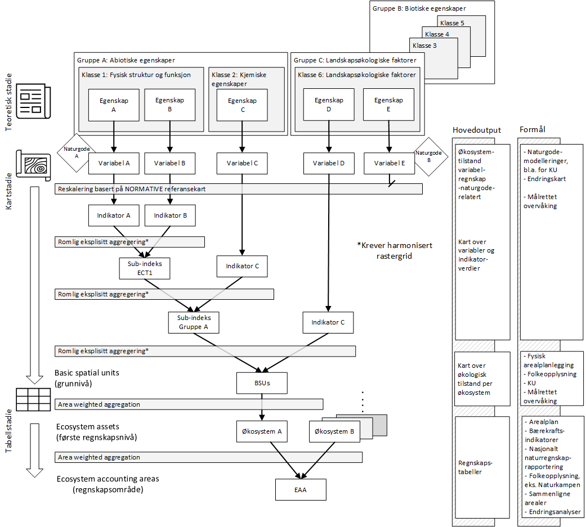

# Arbeidsflyt

Her beskrives den generelle, eller mest typisek, arbeidsflyten.

(\#fig:workflow)Dette er den typiske arbeidsflyten for generering av økologisk tilstandsregnskap for norske kommuner

Figur \@ref(fig:workflow) viser den typiske arbeidsflyten, men det vil kunne forkomme unntak. 
Denne arbeidsflyten er betraktelig endret fra den som ble brukt i fremstillingen av de nasjonale tilstandsrapportene for skog [@Framstad2021] og fjell [@Framstad2022] både med tanke på hvordan vektingene ble utført og på hvor stor vekt det var på kart- versus tabellstadiet. 
For en høyoppløselig pdf-versjon av Figur \@ref(fig:workflow), [klikk her](https://github.com/NINAnor/tilstandsregnskap_NordreFollo2022/tree/main/figures/ECA_Workflow_generisk_norsk.pdf).

