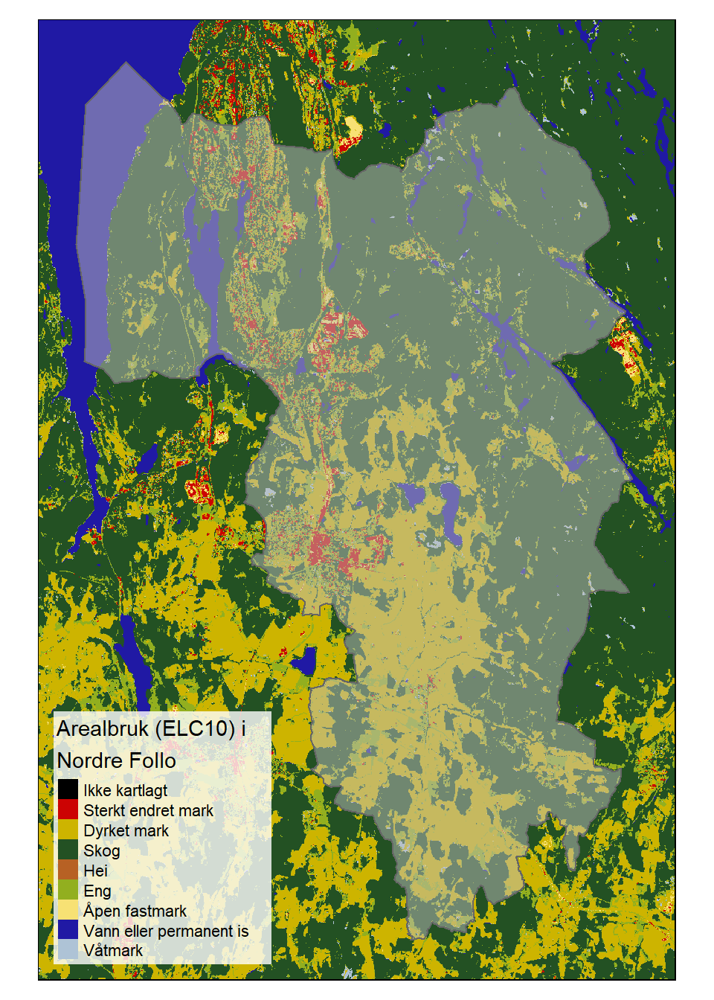

# Eksempler

## Tolv boligområder

Hvilken oppløsning kan vi forvente fra økologisk tilstand?
Kan økologisk tilstand brukes som kunnskapsgrunnlag i arealbrukssaker? 
Her ser vi på ett konkret eksempel med 12 aktueller prosjektområder/boligområder i Nordre Follo kommune.

[//]: # (importer boligområdene. Shapefil levert av David Barton)

[//]: # (Importerer omrisset til Nordre Follo)

[//]: # (Skru på interaktivt kartmodus)

Områdene er spredt rundt i hele kommunen. 

Arealet til prosjektområdene er fra 0.01 til 0.2 km2.

## Indikatorer og variabler
Her følger noen eksempler på ulike variabler og indikatorer og hvordan de kan inngå i [arbeidsflyten](arbeidsflyt.html).

### Pollinatorrikhet {-}

Dette datasettet tetthet av solitaerebier representerer en arealdekkende modellering av artstetthet av solitære bier på en 20 x 20 meters oppløsning [@Sydenham2022; @Sydenham2022b].

[//]: # (Skru på interaktivt kartmodus)

(\#fig:bier)Modellert artsrikhet av solitære bier (se tekst for referanse).

Solitære bier er viktige pollinatorer.
Slik sett kan dette være en fin tilstandsvariabel siden det relevant for pollinering, en sentral naturgode.
Det er ikke ennå klart hvordan denne variabelen kan skaleres til å bli en indikator (jf. Figur \@ref(fig:workflow) ) ,
men det er heller ikke umulig at dette kan utvikles på sikt.
Kartet er heldekkende, men denne variabelen er trolig mest relevant for åpent lavland, spesielt semi-naturlig mark, siden det er her man kan forvente å finne solitære bier.

## Noen utfordringer ved vegg-til-vegg regnskap

I Nordre Follo skal det gjøres et vegg-til-vegg regnskap, i motsettning til i de nasjonale vurderingene hvor man har gjort ett og ett økosystem om gangen. Det vil si at man i Nordre Follo må ha indikatorer for alle de økosystemene eller arealtypene som finnes der. Som vi ser under så er det ganske mange. 

(\#fig:unnamed-chunk-9)Figur X: Kart over Arealtyper i Nordre Follo kommune.

Spesielt vannskelig blir det å finne indikatorer for våtmark, sterkt endret mark (inkl. bebygd areal) og semi-naturlig mark.  Realistisk sett vil det ikke bli mulig å få samme indikatordekning på alle arealer, som vi hadde i de nasjonale vurderingene. Samtidig vil oppløsning på den holistiske tilstandsvurderingen, basert på indikatorer som ligner de vi har brukt i de nasjonel tilstandsvurderingen, ikke gi grunnlag for sikkert å skille lokale områder. 
